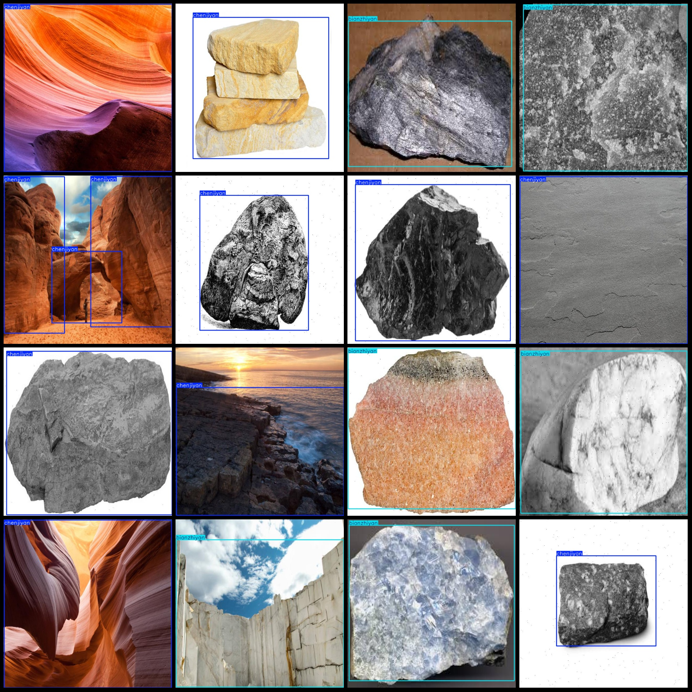
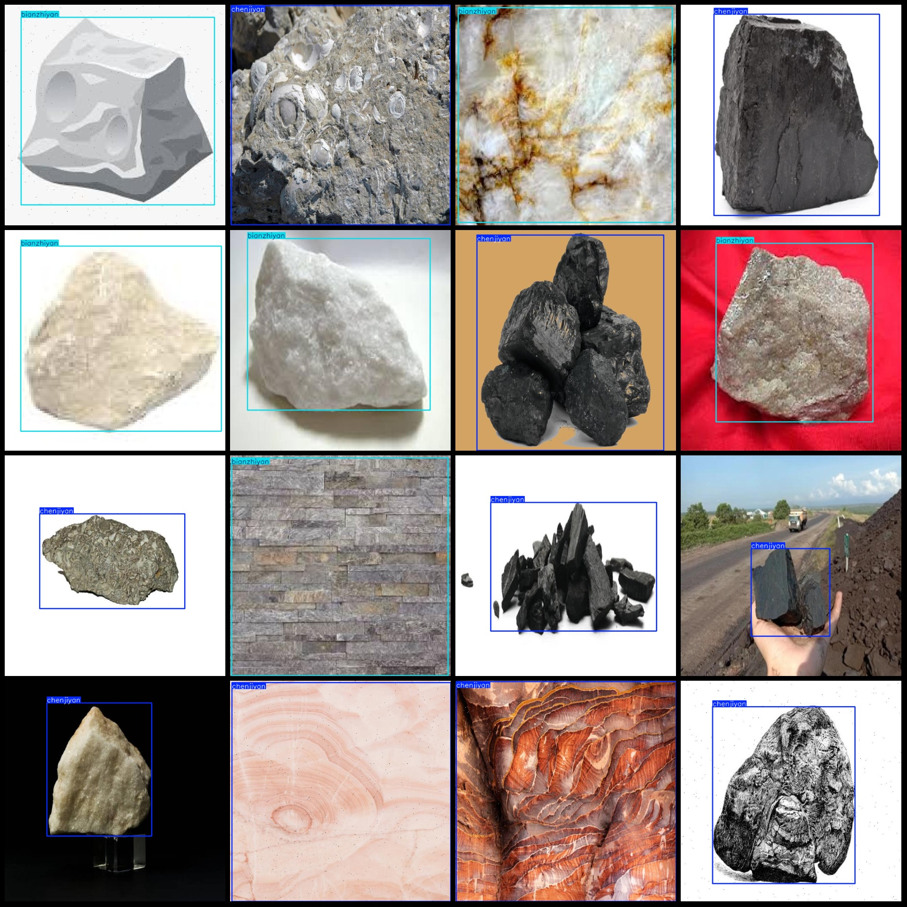

# Rock Classification Dataset: Pascal VOC + YOLO Format (1223 Images, 3 Categories)

Dataset format: Pascal VOC format + YOLO format (txt file without split path, only containing jpg images and corresponding VOC format xml files and YOLO format txt files).
Number of images (jpg file count): 1223
Number of annotations (xml file count): 1223
Number of annotations (txt file count): 1223
Number of categories: 3
Annotation categories name (notice that the order in YOLO format does not correspond to this, but is based on the "labels" folder's "classes.txt"): ["bianzhiyan", "chenjiyan", "huochengyan"]
Corresponding Chinese category names: ["igneous rock", "metamorphic rock", "sedimentary rock"]
Each category annotation box count:
- Bianzhiyan annotation boxes = 788
- Chenjiyan annotation boxes = 751
- Huochengyan annotation boxes = 233
Total annotation boxes: 1772
Each category occupied image count:
- Bianzhiyan occupied image count = 584
- Chenjiyan occupied image count = 489
- Huochengyan occupied image count = 150
Image resolution: 640x640
Annotation tool used: labelImg
Annotation rules: draw rectangular boxes for each category
Important note: The dataset does not have a division into training, validation, and testing sets.
Special declaration: This dataset does not guarantee the accuracy of the trained model or weight file
Image preview:
## Images

Here is a pay link on Stripe ( https://buy.stripe.com/3cs8yP7sY87d0vu9AB ). Please contact me lonlonago@foxmail.com after funding $89, and I will send you a complete data files , thank you!

